  <!-- ===================== MULTILINGUAL GREETING ===================== -->

  

  <h1>Harsha Vardhan Botlagunta</h1>

  

    <strong>Full-Stack Developer</strong> · React · TypeScript · Node.js · Nestjs · MongoDB · SQL
  

  <!-- ===================== TERMINAL PROFILE ===================== -->

  

    <strong>HarshaGitZone ~ $ whoami</strong>
  

  <table>
    <tr>
      <td valign="top" align="center"></td>
      <td valign="top" align="center"></td>
    </tr>
  </table>

   

<!-- ===================== SOCIAL LINKS ===================== -->

<table>
<tr>
<td>

</td>

<td>

</td>

<td>

</td>
</tr>
</table>

<!-- ===================== CONTRIBUTIONS ===================== -->

 

  

---

<!-- ===================== PROJECTS ===================== -->

<h3 align="center">
  <code>HarshaGitZone ~ $ ls ./projects</code>
</h3>

**🚀 Featured Projects**

- 💰 **[FinFlow](https://fin-flow-eight-eta.vercel.app/)** — Personal Finance & Wealth Management · [🌐 Live](https://fin-flow-eight-eta.vercel.app/) · [🎥 Demo](https://drive.google.com/file/d/1thcU6A24lP53D-6aLuGj6aMRhO2bEzOQ/view?usp=sharing)
- ⏳ **[Task Nova](https://tasknova-harshavardhanbotlagunta.vercel.app/)** — Focus & Workflow Management · [🌐 Live](https://tasknova-harshavardhanbotlagunta.vercel.app/) · [🎥 Demo](https://drive.google.com/file/d/1TeOOfpsI1_KVS1sFb6JI-eCihXnop4NG/view)
- ✍️ **[BlogHub](https://bloghub-harshavardhanbotlagunta.vercel.app/)** — MERN Blogging Ecosystem · [🌐 Live](https://bloghub-harshavardhanbotlagunta.vercel.app/) · [🎥 Demo](https://drive.google.com/file/d/1iA01ic6o_ERUCW5asGtVdYrguMcf7ToX/view?usp=sharing)
- 🌍 **[GeoNexusAI](https://geo-nexus-ai.vercel.app/)** — Land Assessment & Risk Prediction · [🌐 Live](https://geo-nexus-ai.vercel.app/) · [🎥 Demo](https://drive.google.com/file/d/1frhz2Ex81sCZHpjaFizrknbPpD4lLVmX/view)
- 👁️ **[Diabetic Retinopathy](https://diabeticretinopathy-it-vnr-2022-26.streamlit.app/)** — Deep Learning · [🌐 Live](https://diabeticretinopathy-it-vnr-2022-26.streamlit.app/) · [🎥 Demo](https://drive.google.com/file/d/1i82U66MMFyP644uGmRdzA3kgQ6Ao1Wwz/view?usp=drive_link)
- 🎪 **College Event Management** — Java · [🎥 Demo](https://drive.google.com/file/d/1orx_jixQIoefrRLgnMOWpv25kYovs0Ev/view?t=0.419)
- 💼 **Personal Portfolio** — HTML · CSS · JavaScript · [🌐 Live](https://harshavardhanbotlagunta.vercel.app/) · [🎥 Demo](https://drive.google.com/file/d/1uAWwqJjsS1VRmWgiEysXDF9POedFAkj2/view)

---

<!-- ===================== TECH STACK ===================== -->

<h3 align="center">
  <code>HarshaGitZone ~ $ cat ./tech-stack</code>
</h3>

## 🛠 Tech Stack

| Category | Skills |
|---------|--------|
| **Languages** |     |
| **Frontend** |         |
| **Backend & Databases** |     |
| **Tools** |    |

---

<!-- ===================== CURRENT FOCUS ===================== -->

<!-- <h3 align="center">
  <code>HarshaGitZone ~ $ cat ./current-focus</code>
</h3>

### 🎯 Currently Exploring

**Full-Stack Development** · **React** · **TypeScript** · **Node.js** · **MongoDB**

Building useful applications, exploring new technologies,
and continuously improving as a developer.

 -->

<!-- ===================== CONNECT ===================== -->

<!-- 

<h3>
  <code>HarshaGitZone ~ $ connect</code>
</h3>

&nbsp;

   -->

<code>Thanks for visiting! 🚀</code>

