  <!-- CONTRIBUTION GRAPH -->
  

    

  <!-- TERMINAL IDENTITY -->
  <h3>
    <code>HarshaGitZone ~ $ whoami</code>
  </h3>

  <table>
    <tr>
      <td valign="top">
        
      </td>

      <td valign="top">
        
      </td>
    </tr>
  </table>

   

  <!-- SOCIAL LINKS -->
  

  &nbsp;

  

<h3 align="center">
  <code>HarshaGitZone ~ $ ls ./projects</code>
</h3>

## 🚀 Featured Projects

- 💰 **[FinFlow](https://fin-flow-eight-eta.vercel.app/)** — Personal Finance & Wealth Management
  · [🎥 Demo](https://drive.google.com/file/d/1thcU6A24lP53D-6aLuGj6aMRhO2bEzOQ/view?usp=sharing)

- ⏳ **[Task Nova](https://tasknova-harshavardhanbotlagunta.vercel.app/)** — Focus & Workflow Management
  · [🎥 Demo](https://drive.google.com/file/d/1TeOOfpsI1_KVS1sFb6JI-eCihXnop4NG/view)

- ✍️ **[BlogHub](https://bloghub-harshavardhanbotlagunta.vercel.app/)** — MERN Blogging Ecosystem
  · [🎥 Demo](https://drive.google.com/file/d/1iA01ic6o_ERUCW5asGtVdYrguMcf7ToX/view?usp=sharing)

- 🌍 **[GeoNexusAI](https://geo-nexus-ai.vercel.app/)** — Land Assessment & Risk Prediction
  · [🎥 Demo](https://drive.google.com/file/d/1frhz2Ex81sCZHpjaFizrknbPpD4lLVmX/view)

- 👁️ **[Diabetic Retinopathy](https://diabeticretinopathy-it-vnr-2022-26.streamlit.app/)** — Deep Learning
  · [🎥 Demo](https://drive.google.com/file/d/1i82U66MMFyP644uGmRdzA3kgQ6Ao1Wwz/view?usp=drive_link)

- 🎪 **College Event Management** — Java
  · [🎥 Demo](https://drive.google.com/file/d/1orx_jixQIoefrRLgnMOWpv25kYovs0Ev/view?t=0.419)

- 💼 **Personal Portfolio** — HTML · CSS · JavaScript
  · [🎥 Demo](https://drive.google.com/file/d/1uAWwqJjsS1VRmWgiEysXDF9POedFAkj2/view)

---

<h3 align="center">
  <code>HarshaGitZone ~ $ cat ./tech-stack</code>
</h3>

## 🛠 Tech Stack

| Category | Skills |
|---------|--------|
| **Languages** |     |
| **Frontend** |         |
| **Backend & Databases** |     |
| **Tools** |    |

---

<h3 align="center">
  <code>HarshaGitZone ~ $ cat ./current-focus</code>
</h3>

**Full-Stack Development** · **React** · **TypeScript** · **Node.js** · **MongoDB**

Building useful applications, exploring new technologies, and continuously improving as a developer.

---

### <code>HarshaGitZone ~ $ exit</code>

**Thanks for visiting! 🚀**

 

&nbsp;

